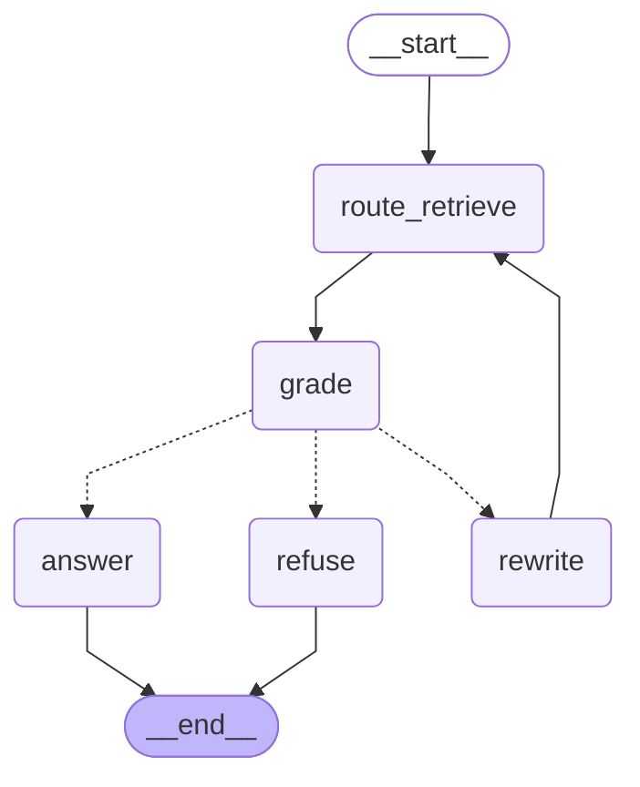

# Agent graph

Exported by `docintel export-graph`.

```mermaid
---
config:
  flowchart:
    curve: linear
---
graph TD;
	__start__([<p>__start__</p>]):::first
	route_retrieve(route_retrieve)
	grade(grade)
	rewrite(rewrite)
	answer(answer)
	refuse(refuse)
	__end__([<p>__end__</p>]):::last
	__start__ --> route_retrieve;
	grade -.-> answer;
	grade -.-> refuse;
	grade -.-> rewrite;
	rewrite --> route_retrieve;
	route_retrieve --> grade;
	answer --> __end__;
	refuse --> __end__;
	classDef default fill:#f2f0ff,line-height:1.2
	classDef first fill-opacity:0
	classDef last fill:#bfb6fc
```
